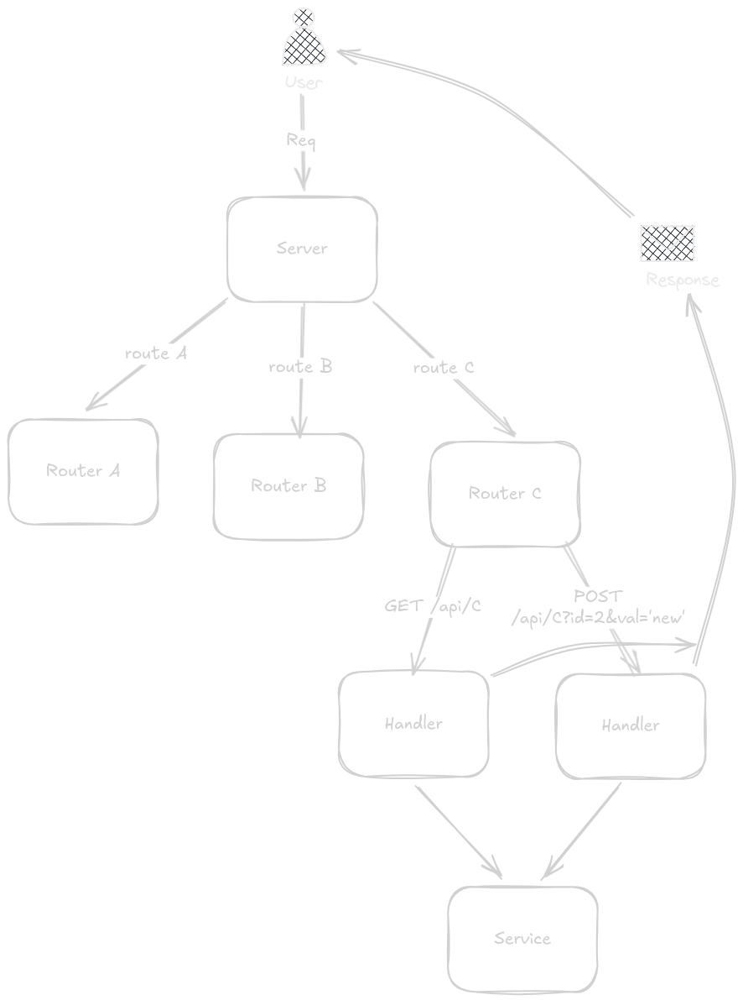

# Overview

This document serves as a general overview of the project structure, explaining how all the pieces fit and work together.

# Frontend

The frontend is written in Svelte, uses Tailwindcss, and is located in `client/` directory in the project root.

> [!IMPORTANT]
> You must have [node](https://nodejs.org/en) and [npm](https://www.npmjs.com/) installed!

Before running or modifying the frontend, install the necessary dependencies:

```bash
npm install
```

Then you can either spin up a dev server or compile/build the frontend.

- Development Server: To start a development server, which allows you to see changes in real-time as you develop, you use:

```bash
npm run dev
```

- Build Process: To compile and build the frontend for production, you use:

```bash
npm run build
```

> [!INFO]
> Build is outputted in `server/static`

## How the Frontend Works

The frontend is built using Svelte, with each page and component defined in `.svelte` files. During the build process, these files are compiled into standard HTML, CSS, and JavaScript, which are then output to the `server/static` directory. The Go server serves these static assets to clients.

For dynamic interactions and data fetching, the frontend communicates with the backend through various `/api/` routes, sending requests and processing responses to update the UI accordingly.

# Backend

The backend is written in Go and implements an HTTP server using the standard `net/http` library. It handles requests, serves static files, and provides various /api/ endpoints for the frontend to interact with.

To run the server:

```bash
go run ./cmd/server/main.go
```

> [!WARNING]
> Remember to build the frontend first!

## How the Backend Works

The `main.go` file initializes the HTTP server, loads configurations, and registers API routes. Each API route is handled by a corresponding **router** located in `internal/router`

- `/api/product` --> `productRouter`
- `/api/user` --> `userRouter`
- `/` --> `pageRouter`

Each router defines its **endpoints** and their **handler functions**. Where necessary a handler function invokes a **service** from `internal/services`

Additionally routers can also use **middleware** from `internal/middleware` for such functions as logging and performing authentication.

```
sever
├── cmd
│   └── server
│       └── main.go
├── internal
│   ├── config
│   │   └── config.go
│   ├── middleware
│   │   └── ...
│   ├── routers
│   │   └── ...
│   └── services
│       └── ...
└── static
```

So when a sever receives a request, the request takes the following path, before sending a response:

`User -> Server -> Router -> Handler func -> User`


_Diagram showing the backend structure and request flow._

## Config

All server configurations, such as the server port and log level, are defined in `internal/config/config.go`.

When the server starts, it loads the configuration, reading values from the `.env` file. If a value is not found, a default value is used instead.

**TODO:** Implement `.env` support for configuration.
